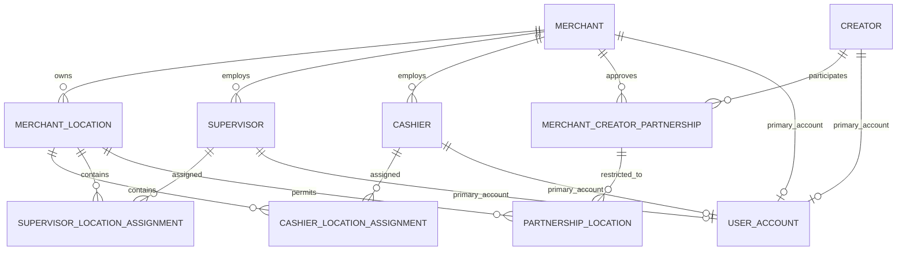

# Database Design

Milestone 2 uses EF Core with the Npgsql PostgreSQL provider. Internal identifiers are `uuid` values, timestamps use PostgreSQL `timestamp with time zone`, and enums are stored as readable strings. Every entity carries UTC audit fields. Core relationships use `Restrict` or `NoAction` deletion to preserve business records.

## Relationships



An approved partnership with no `PartnershipLocation` rows is intended to apply to all active merchant locations. Rows can later restrict it to selected locations.

## Constraints and indexes

Unique indexes protect normalized account email, public creator/merchant IDs, non-empty creator normalized phone numbers, each merchant/creator pair, and all three assignment pairs. Status, ownership foreign keys, normalized contact fields, merchant/creator partnership status combinations, and partnership end dates are indexed for anticipated queries.

Public IDs such as `CR-000001` and `MRC-000001` are constrained for uniqueness, but generation is intentionally deferred.

## Setup and migrations

The Docker service is `creatorpay-postgres` and its default database is `CreatorPayV2Db`. Credentials come from a local `.env` file and must not be committed. The runtime connection-string name is `CreatorPayDatabase`.

```powershell
dotnet ef migrations add <Name> --project src/CreatorPay.Infrastructure --startup-project src/CreatorPay.Api --output-dir Persistence/Migrations
dotnet ef migrations list --project src/CreatorPay.Infrastructure --startup-project src/CreatorPay.Api
dotnet ef database update --project src/CreatorPay.Infrastructure --startup-project src/CreatorPay.Api
```

The application does not auto-apply migrations. Metadata tests exercise the Npgsql model without opening a connection; full PostgreSQL container integration is a known future task.
