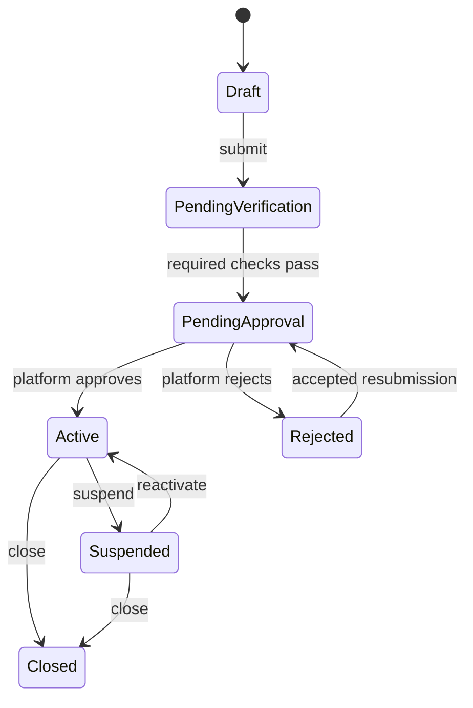

# Registration and Verification

All transitions and notification attempts are audited. Common failures are duplicate normalized identifiers, expired/single-use tokens, invalid files, rate limits, stale state, or unauthorized scope. Passwords are hashed; verification tokens are random, hashed at rest, expiring and single-use.

| Workflow | Actor / preconditions | Required data and validation | Status transitions | Notifications / acceptance |
|---|---|---|---|---|
| Creator registration | Public; no existing normalized email/phone | name, display name, email, Ethiopian phone, password, consent; unique normalized values and password policy | `Draft → PendingVerification → PendingApproval` | Verify email/phone; submission acknowledgement; cannot become Active without Admin approval |
| Merchant registration | Public Merchant Admin | legal/trading name, type, contact, email/phone, address, tax/document fields when required | account/merchant `Draft → PendingVerification → PendingApproval` | Verification and review messages; no merchant operations before approval |
| Location creation | Active Merchant Admin | name, address, city, country, valid time-zone; same merchant | new active location; active ↔ inactive | Staff affected are notified; inactive locations reject new transactions |
| Merchant Admin creation | Registration creates primary; later Admin invitation by authorized Merchant Admin/Platform Admin | unique email/phone, merchant binding, invitation | invitation → PendingVerification → Active; Active → Suspended/Closed | Invite and status alerts; cannot bind across merchants |
| Supervisor/Cashier creation | Active Merchant Admin; active merchant/location | identity, unique contact, active location assignments | PendingVerification → Active; Active ↔ Suspended; → Closed | Invite/assignment messages; at least one active assignment to transact/approve |
| Email/phone verification | Pending account | token/OTP, expiry, attempt and resend limits | flag false → true; both required before PendingApproval/Active as applicable | Success/failure without account enumeration |
| Identity verification | Creator under review | configured identity fields/files, consent; format, malware and reviewer checks | NotSubmitted → Pending → Verified/Rejected/ResubmissionRequired | Reasoned outcome and resubmission path |
| Merchant documents | Merchant under review | registration/licence/tax/bank-related documents only as legally required | same document states | Reviewer decision and expiry reminders |
| Password reset | Account exists (response remains generic) | single-use token, new compliant password | sessions/recovery tokens revoked after reset | Security notice on request and completion |
| Suspension/reactivation | Authorized Admin | reason, evidence, effective time | Active/LowBalanceRestricted → Suspended → eligible prior state/Active | Immediate actor/account notice; transactions denied while suspended |
| Closure | Account owner request or Platform Admin | confirmation, reason, unsettled obligations check | eligible state → Closed | Revoke sessions; retain regulated/audit/financial records; anonymize when permitted |

## Workflow contract

Every implementation use case must define actor, preconditions, required fields, validation, transition, notifications, errors, audit event and tests. Submission is atomic: verification flags and review status cannot diverge. Identity/merchant-document requirements, acceptable document types, retention and reviewer access remain legal/compliance open items.

