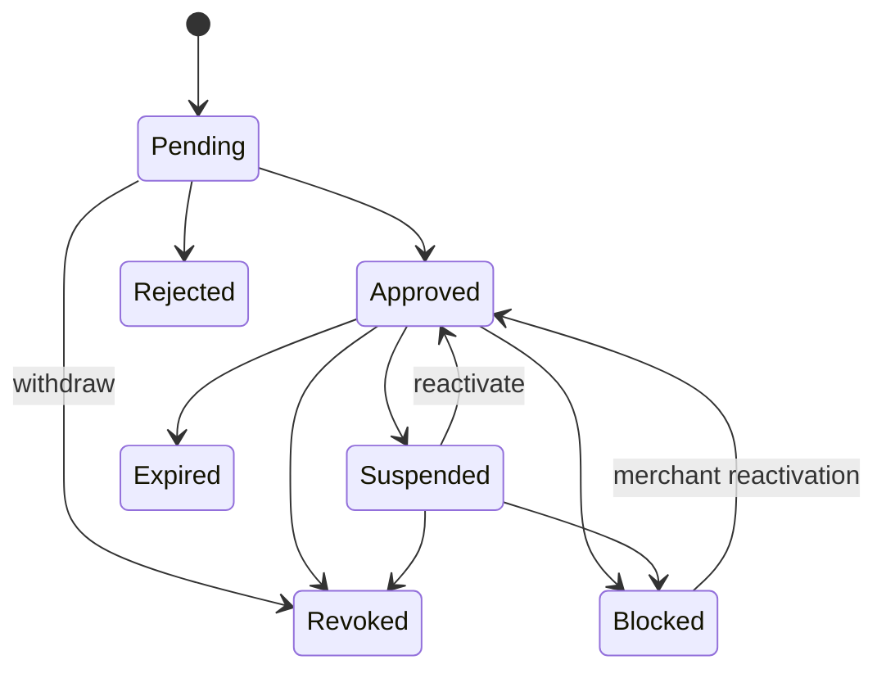
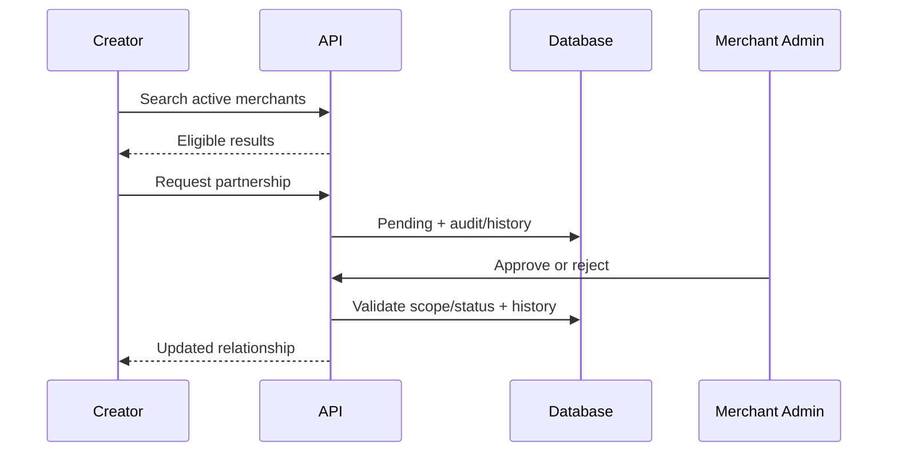

# Merchant–Creator Partnerships (Milestone 8)

CreatorPay uses two approval levels: a Platform Admin first activates a creator, then each merchant independently approves that creator. Platform approval never grants automatic promotion rights.

Every change appends `PartnershipStatusHistory`; historical rows are not rewritten. Blocked relationships cannot be bypassed.

Eligibility requires Approved status, active creator and merchant, an inclusive start boundary, exclusive end boundary, and—when restricted—a matching active merchant location. The reusable domain service accepts evaluation time.

Assignments must belong to the partnership merchant and be active. Removal deactivates an assignment rather than deleting it. No active assignments means all active locations.

Creator APIs use `/api/v1/creator`; Merchant Admin APIs use `/api/v1/merchant`; Platform Admin has read-only `/api/v1/admin/partnerships`. Scope comes from authenticated claims. Cashiers and supervisors have no management access. Responses use DTOs and Problem Details.

Audits cover requests, direct additions, transitions, date/location changes, invalid transitions, and cross-merchant attempts without sensitive search/profile data.

Known limitations: no renewal/resubmission endpoint, automated expiration job, commissions, campaigns, notifications, QR validation, wallets, transactions, earnings, or payouts. Milestone 9 QR validation must call the eligibility service with supplied time and location.
# Milestone 9 dependency

QR validation requires an `Approved` partnership whose start/end window includes the validation time. Suspended, blocked, expired, not-yet-started, and absent partnerships return distinct safe results. When active partnership-location records exist, the selected location must be included.
# Commission integration (Milestone 10)

An approved partnership may receive an effective-dated commission override. Merchant Admin can view it only for their merchant; a Creator can view it only for their own approved partnership. The override outranks merchant and platform defaults and is below a supplied campaign override. This does not create transactions or earnings.
