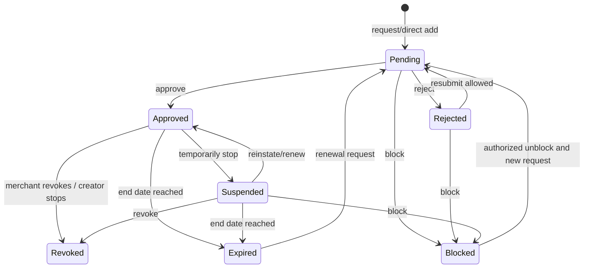

# Merchant-Creator Partnerships

One durable partnership record exists per merchant/creator pair, consistent with the current unique database constraint. Requests may originate from creator search, a merchant scanning the permanent creator QR, merchant creator search, or direct add. Direct add still produces `Pending` unless the same authorized merchant action explicitly approves it and captures the decision audit.

`Pending`, `Approved`, `Rejected`, `Suspended`, `Revoked`, `Expired`, and `Blocked` are the canonical statuses. Transitions not shown are invalid. Renewal returns to review; history is retained. Blocking prevents new requests until an authorized merchant user unblocks. Rejection is a decision on a request; revocation ends prior approval; suspension is reversible. Creator “stop promoting” becomes `Revoked` and is audited with creator as actor.

## Eligibility at transaction time

Eligibility requires all of: authentic active QR; Creator and creator account Active; Merchant Active (not LowBalanceRestricted for commission purchases); Cashier/account Active; active cashier assignment to the chosen active location; partnership `Approved`; start absent or `<= now`; end absent or `> now`; no location rows or an active row for the chosen merchant location; any campaign active and applicable; and a resolvable effective commission rule. All checks occur server-side again at confirmation/sync time.

Merchant Admin manages requests, location restrictions, dates, campaign and partnership commission assignment. Supervisors may view assigned-location eligibility but cannot decide unless explicitly granted a future permission. Creators can search only discoverable active merchants, request, view reason-safe status and stop. Performance reports include attributable gross sales, commissions, transaction/reversal counts and time/location/campaign filters; they must not expose customer phones.

Current Milestone 2 methods implement only a subset of this state graph; later milestones must extend behavior without rewriting history.
