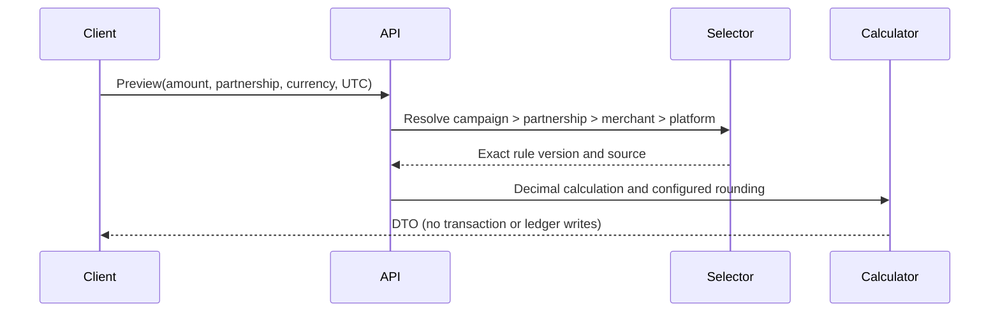

# Commission Engine

Milestone 10 introduces configurable, effective-dated and versioned commission rules. A plan groups rules; a rule identifies its scope and ISO currency; immutable versions hold rates, amount bounds, UTC validity, and rounding. Assignments connect rules to the platform, merchant, partnership, or a campaign reference placeholder.

## Resolution and calculation

Priority is campaign override, partnership override, merchant default, then platform default. The selector rejects inactive, future, expired, overlapping-version, and currency-incompatible configuration. No eligible rule is a configuration error.

All arithmetic is `decimal`. The engine rounds `purchase × merchant rate / 100`, rounds `total × creator share / 100`, then gives the platform `total − creator`, guaranteeing conservation. `AwayFromZero`, `ToEven`, `Down`, and `Up` are supported. ETB currently has two fraction digits.

For 500 ETB at 10%, split 70/30: total commission is 50.00 ETB, creator commission 35.00 ETB, and platform commission 15.00 ETB. These values are configuration, never constants.

`CommissionCalculationSnapshot` stores exact input, selected IDs/source, rates, amounts, rounding, timestamp, and calculation version for future purchase processing. Preview does not create snapshots. Published versions have no update endpoint; corrections require a new non-overlapping version. Snapshot foreign keys are restrictive.

## Access, APIs, and audit

Platform Admin owns `/api/v1/admin/commission-plans`, `/commission-rules`, `/commission-assignments/*`, and `/commission-preview`. Merchant Admin has scoped effective/partnership views and preview. Creators can view only approved partnerships they own. Supervisor and Cashier have no commission endpoints. DTO projections and Problem Details prevent entity exposure on reads; scoped misses return 404.

Audited events include plan/rule/version changes, activation, default and override assignments, previews, invalid configuration, and denied scoped preview attempts. Audit values omit personal data and secrets.

Known limitations: no campaign management (assignment placeholder only), currency metadata remains fixed at two fraction digits, database exclusion constraints for overlapping assignments are deferred, and snapshots are not yet attached to purchases. Wallets, purchases, earnings, revenue, settlement, payouts, disputes, notifications, and offline behavior remain out of scope.
