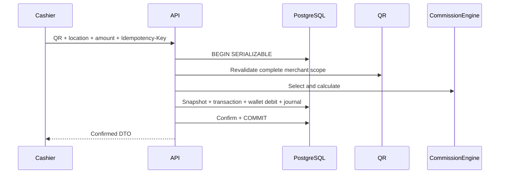

# Merchant Wallet and Deposits

## Milestone 11 implementation

One lazy-created ETB wallet exists per eligible merchant. Manual deposits move from `PendingVerification` to `Completed` on Platform Admin approval, which atomically credits the wallet, records before/after balances, and posts a balanced journal. Rejection moves the request to `Failed` without changing balance.

Purchase confirmation runs in one PostgreSQL serializable transaction: staff/location/merchant/QR/creator/partnership are revalidated, the commission rule is selected, an immutable snapshot and pending transaction are created, the wallet is debited, ledger and balanced journal rows are posted, and the transaction becomes `Confirmed`. Any failure rolls back all financial records.

Concurrency uses the PostgreSQL wallet row version plus serializable isolation. Unique wallet, reference, transaction, and `(Scope, Key)` indexes provide the second line of defense. Same-key/same-fingerprint requests replay the original response; differing payloads return a conflict. `FinancialJournal.Post` requires total debits equal total credits. Confirmed purchases debit `MerchantWalletLiability` and credit `CreatorPayable` plus `PlatformCommissionRevenue`.

The API and UI expose merchant wallet/deposits/purchases, Platform Admin deposit review and purchase support, and cashier purchase entry/recent submissions. Audit records cover wallet creation, deposit decisions, wallet credits/debits, purchase attempts/confirmation, and restrictions. Customer verification, repeat-use approval, payouts, notifications, disputes/reversals, offline mode, file bytes, and payment providers remain out of scope.

Each merchant has a prepaid ETB wallet backed by an append-only double-entry-style ledger. `available balance = posted deposits and credits − posted debits − active holds`. Cached balances are projections checked against the ledger.

## Deposits and controls

For MVP, Merchant Admin submits amount, channel/reference and proof. A Platform Admin independent reviewer verifies evidence and posts or rejects it; duplicate provider/reference values are prevented. Future Telebirr or another provider is behind a provider abstraction with signed callback verification, idempotency and reconciliation; provider-specific fields and behavior remain open.

Ledger entry types include DepositPending, DepositPosted, HoldPlaced/Released/Captured, CommissionDebit, RefundCredit, ReversalCredit/Debit and Adjustment (reason plus dual authorization). Entries are immutable, UTC-stamped, currency-specific, correlated to their source and balanced. Never edit/delete a financial entry; compensate it.

The initial suggested low-balance threshold is 1,000 ETB but is Platform Admin configurable per policy/merchant. Crossing it queues a warning. Insufficient funds or `LowBalanceRestricted` blocks new commission transactions but not sign-in, statements, deposit submission, or remediation. Atomic row/version locking prevents the available balance becoming negative. Holds are reserved, expiring amounts and are not spendable.

Daily automated and operator reconciliation compares internal deposits/ledger/provider settlement; discrepancies become cases. Refund/reversal rules use the original transaction snapshot and link all entries. Deposit decisions, threshold changes, holds, restrictions, adjustments and exports require audit events.
# Milestone 12 liability settlement

Purchase confirmation still creates CreatorPayable exactly once. Creator earning creation adds no journal. A successfully confirmed manual payout later debits CreatorPayable and credits PaymentClearing; failure or cancellation leaves the liability unchanged.
# Milestone 14 notification readiness

Notification types cover deposits, wallet low balance, insufficient balance and purchase outcomes. Low-balance integration must use the existing wallet status transition (`Active` to `LowBalance`) rather than emitting on every debit, allowing another warning only after recovery to `Active` and a later crossing.
