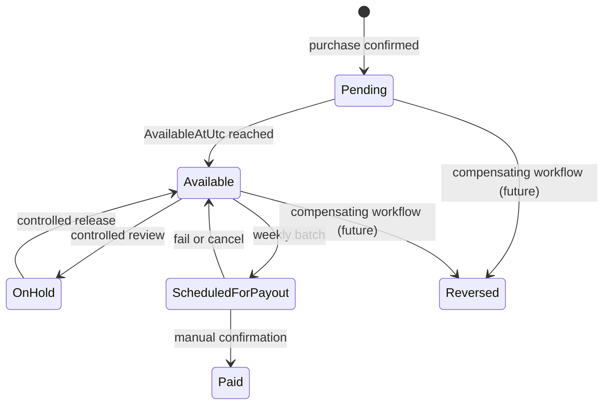
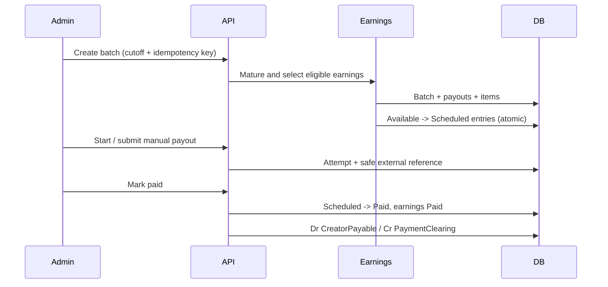

# Creator Earnings and Weekly Payout Preparation

Milestone 12 creates one immutable `CreatorEarning` from the creator amount in the confirmed purchase's commission snapshot. The purchase transaction, pending credit, balance entry, and existing CreatorPayable journal are committed together. The earning handler is idempotent by the unique purchase transaction ID; it never recalculates old commission values.

## Lifecycle and balances

Each creator/currency has one concurrency-controlled summary account. Pending, Available, Held, and Scheduled are current liabilities; PaidLifetimeTotal and ReversedLifetimeTotal are cumulative. Every movement writes an immutable, uniquely keyed `CreatorBalanceEntry`. A transfer checks the source first, so no category can become negative.

The configured holding period determines `AvailableAtUtc`. Maturation accepts a supplied UTC time and is idempotent. Held, scheduled, paid, and reversed records are excluded.

## Weekly payout process

Eligibility requires an active creator, ETB available earnings earned on or before the cutoff, no existing payout item, and a creator total at or above the configured minimum. Manual review and automatic limits are configuration foundations; all transfers remain manual in this milestone. Only safe provider references are stored.

A failed or cancelled payout releases its scheduled earnings and balance to Available without reducing CreatorPayable. Retry reuses the payout and items and creates a new attempt; the unique payout journal reference prevents a second settlement journal. Batch totals are derived from payout totals, and payout totals from selected earning amounts.

## API and authorization

Creators can read only their own earnings, summary, payout history, and payout details under `/api/v1/creator`. Platform Admin alone can mature earnings, create/process/cancel batches, and submit/mark/retry/cancel payouts under `/api/v1/admin`. Merchant Admin, Supervisor, and Cashier have no payout access. DTOs omit destination credentials. Financial transitions write creator audit events without provider secrets.

The React creator workspace provides balance cards, status-filtered earnings history, estimated next payout, and payout history. The Platform Admin workspace provides batch creation/details and a confirmation-gated payout queue. It uses ETB formatting, status badges, loading/empty/error states, responsive tables, English strings, and Unicode-ready presentation.

## Known limitations

The only provider is a development/manual adapter; no Telebirr, bank, card, wallet, webhook, or reconciliation call exists. Payout destination enrollment, automated/manual-review approval, holds/releases, post-payment reversals, tax withholding, notifications, disputes, and fraud workflows remain future work. The PaymentClearing credit represents a manual external settlement pending future cash/bank reconciliation.
# Milestone 14 notification integration

Confirmed creator earnings and transitions to available create idempotent creator in-app notifications. The payload contains creator amount, currency, pending/available meaning, and weekly payout guidance; it excludes customer phone, gross purchase value, platform commission, and merchant wallet balance. Payout notification types and safe placeholder vocabulary are reserved for scheduled, submitted, paid and failed lifecycle integration.
