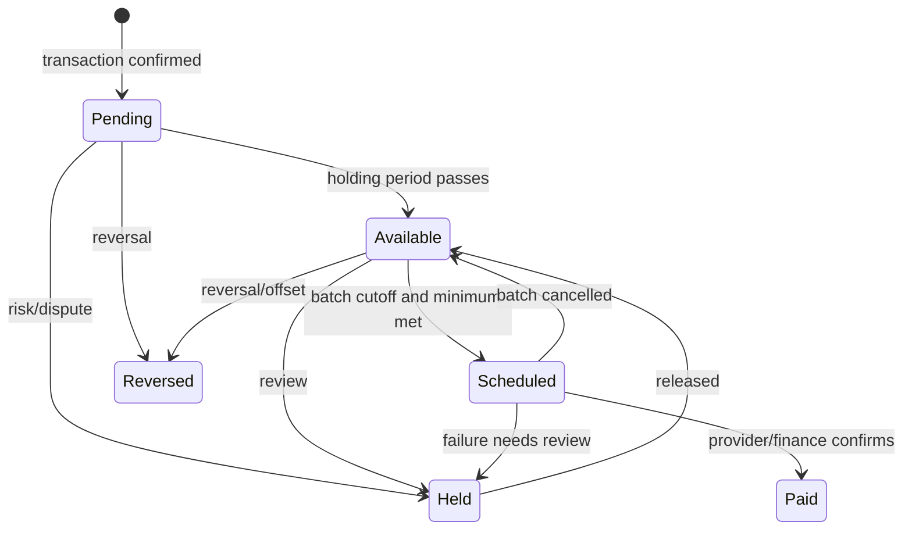

# Creator Earnings and Payouts

An earning is created atomically with a confirmed transaction and immediately notified, but paid only through the weekly payout process.

Platform configuration versions the holding period, minimum payout, weekly payout day, cutoff and time zone. A batch freezes eligible available earnings at cutoff, groups by creator/currency and creates idempotent payout instructions. Below-minimum balances roll forward. Manual review can hold an earning or payout with reason and audit trail.

The provider abstraction supports submit, query, callback, cancel-when-safe and reconciliation without assuming a bank/mobile-money API. A failed payout records safe failure code; transient failures retry with backoff/idempotency, permanent/ambiguous failures go to review. Never mark Paid from a client response alone. Reconciliation matches provider reference, amount, beneficiary and status.

Creator statements show opening/closing balances and transaction-level pending, available, held, scheduled, paid and reversed movements with masked payout destination. Corrections are compensating records. Tax withholding, beneficiary KYC, payout rails, settlement timing and treatment of reversals after payout are open legal/banking decisions.
