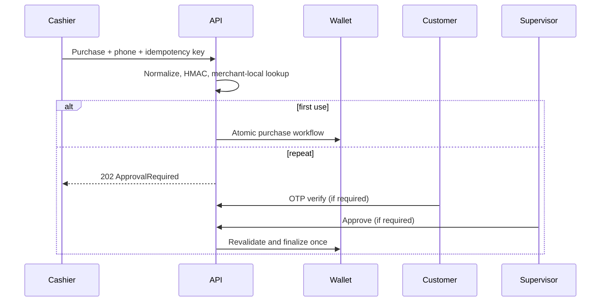
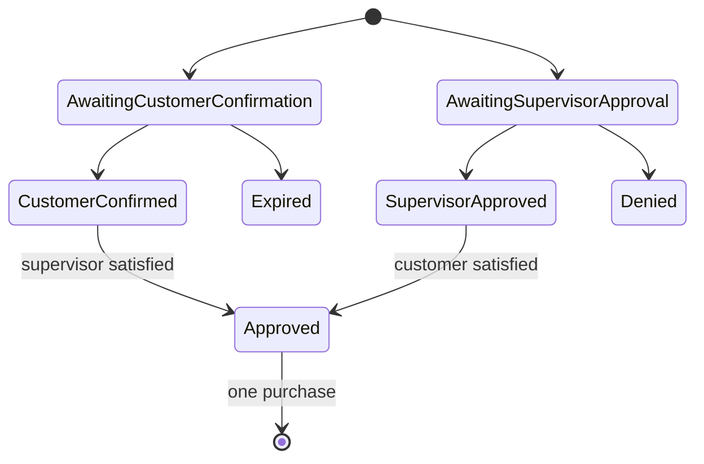

# Customer Phone and Repeat Use

## Milestone 13 implementation

Inputs `09XXXXXXXX`, `2519XXXXXXXX`, and `+2519XXXXXXXX` normalize to Ethiopian E.164. Duplicate lookup uses HMAC-SHA-256 with a deployment secret; recoverable values use AES-GCM authenticated encryption. APIs expose only a mask such as `+251 9** *** 678`.

The confirmed-use key is `(merchant, creator, phone HMAC, merchant-location local date)`. Repeats create an expiring request whose policy can require customer OTP, supervisor/merchant-admin approval, or both. OTPs are cryptographically generated, stored only as keyed hashes, attempt-limited, expiring, and single-use. Development codes are returned once only when explicitly enabled.

Limitations: the provider is development/mock only; no SMS gateway, fraud scoring, general notifications, offline synchronization, disputes, reversals, or override is included.

Accept common Ethiopian mobile forms such as `09XXXXXXXX`, `9XXXXXXXX`, `2519XXXXXXXX` and `+2519XXXXXXXX`; remove permitted formatting and normalize to `+2519XXXXXXXX` (E.164). Final ranges must come from a maintained telecom policy, not a hard-coded example alone. Invalid/ambiguous values are rejected.

Store: an encrypted recoverable E.164 value only where an approved notification/dispute purpose requires it; a keyed HMAC of normalized E.164 for equality checks; last-four/masked display such as `+251 9** *** 123`; key version and retention metadata. Encryption and HMAC keys are separate and rotated. Search/log/API data never exposes full values by default.

## Base rule and exception

Base eligibility is once per customer phone HMAC, merchant and merchant-local calendar date. Determine the date with the transaction location's stored time zone. Different locations of the same merchant share the limit. Configurable rules must be versioned; any change applies prospectively.

On a duplicate, Cashier creates an expiring repeat-use request linked to the proposed operation and reason. An actively assigned Supervisor approves or denies it; approval alone is insufficient. The customer must confirm a single-use, rate-limited OTP before expiry. Only then may the server revalidate and confirm the transaction. Expiry/denial closes the request; a new request is required.

Audit request, reason, supervisor decision, OTP dispatch/result (never OTP), expiration and final transaction. Customer phone access is purpose-limited; creators cannot view it, merchant reports use aggregates, and retention/deletion/consent rules remain a privacy/legal open item.
# Milestone 14 notification integration

Verification requests now create `CustomerVerificationCode` SMS notifications through the outbox. Only the OTP hash is persisted; the raw value is never included in notification JSON, delivery attempts, audit data, or admin APIs. Development revelation requires an explicit notification configuration flag.

## Offline synchronization

The PWA masks and AES-GCM protects phones in IndexedDB. The server normalizes/protects them and resolves merchant-local day at receipt. Repeat retries reuse one approval request and never create OTP automatically; confirmed records discard sensitive ciphertext.
