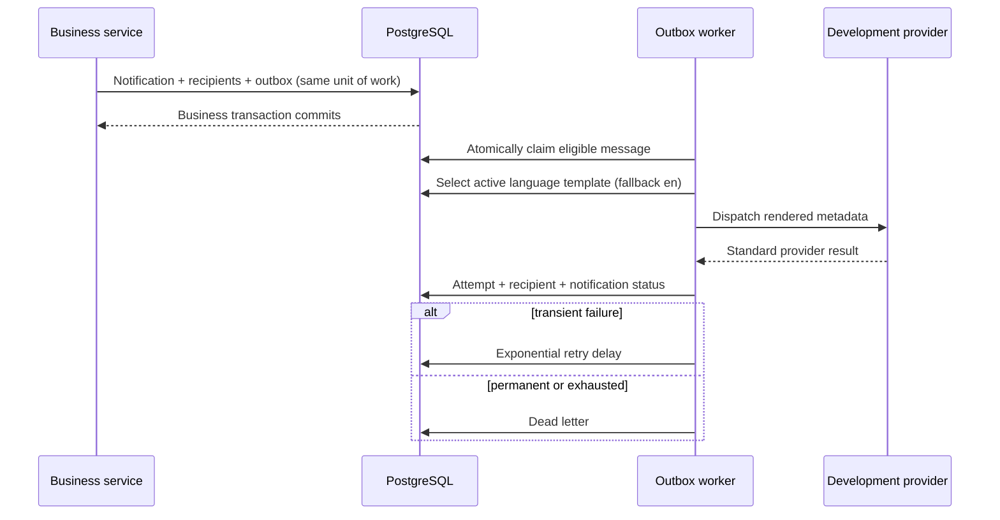

# Notifications and provider foundation

Milestone 14 adds durable in-app, email, SMS, and push notification abstractions. All providers are development metadata providers: no external message is sent. Telegram and WhatsApp are reserved enum values and deliberately return a permanent `PROVIDER_NOT_IMPLEMENTED` result.

## Architecture



`Notification` is the user-visible event. `NotificationRecipient` tracks a channel independently, so a successful channel is never resent merely because another channel fails. `NotificationOutboxMessage` separates business commits from provider availability. `NotificationDeliveryAttempt` stores safe provider metadata, never message bodies or raw OTPs. `NotificationDeadLetter` supports audited retry and resolution.

The processor claims messages using a conditional database update, recovers locks older than `LockTimeoutMinutes`, handles cancellation, and is exposed through `INotificationOutboxProcessor` so it can later run in a dedicated worker. The API hosts a `BackgroundService` for local operation.

## Templates

Templates are immutable versions identified by notification type, channel, language and version. Creating a version inserts a new row. English (`en`) is the fallback; Amharic (`am`) is accepted. The formatter supports only `{PlaceholderName}` replacement from an explicit allow-list. Unknown placeholders, script markup, and executable template syntax are rejected. Existing delivery attempts are not rerendered.

## Preferences and required events

Users manage only their own preferences. Security alerts, password reset, customer verification, purchase confirmation, payout results and operational alerts retain required channels. In-app delivery remains enabled for mandatory authenticated-user events. Platform administrators inspect delivery operations but cannot silently edit another person's preferences.

## Verification codes

OTP generation remains cryptographically secure and separate from dispatch. `CustomerConfirmation` stores only the HMAC hash. The notification and SMS recipient use a stable idempotency key and masked destination; the outbox contains no raw OTP. A code is returned once only when both legacy development return behavior and `Notifications:DevelopmentRevealVerificationCode` are enabled. Production configuration keeps both false.

## APIs

Authenticated users have list/detail, unread count, mark-read, mark-all-read and preference endpoints under `/api/v1`. Results are scoped by JWT user ID. Platform Admin endpoints under `/api/v1/admin` expose safe notification status, outbox, dead letters, retries/cancellation, and template versions. Provider destination references and OTP values are excluded from administrative views.

## Configuration

```json
"Notifications": {
  "BatchSize": 25,
  "PollIntervalSeconds": 10,
  "MaximumAttempts": 5,
  "InitialRetryDelaySeconds": 30,
  "MaximumRetryDelayMinutes": 30,
  "LockTimeoutMinutes": 5,
  "DevelopmentRevealVerificationCode": false
}
```

Retry delay is exponential and capped. Permanent failures and exhausted transient failures dead-letter. Manual retry resets availability but preserves attempt history. Cancellation prevents later delivery.

## Audit and privacy

Notification creation, outbox creation, submission/failure, dead-letter, manual retry, cancellation, read actions, preference changes, template lifecycle and dead-letter resolution create notification audit records. Audit detail contains identifiers, channel and error code only. Raw OTP, full phone, payout destination, message body, password, and cryptographic material are forbidden.

## Current integrations and limitations

Customer verification codes and success, creator earnings recorded, and earnings availability use this foundation with stable keys. Remaining legacy workflows can adopt `INotificationService` incrementally without provider coupling. No external queue, callback/webhook delivery receipt, Firebase/APNs, email gateway, SMS gateway, WhatsApp, Telegram, Telebirr, or bank integration exists. Production providers must implement the channel interface, secret management, provider idempotency, and callback authentication without changing business services.
