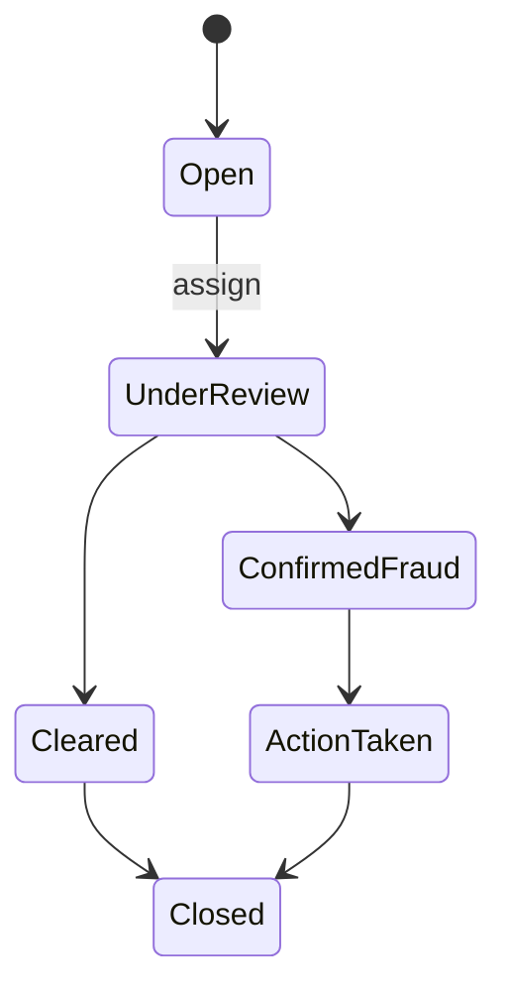
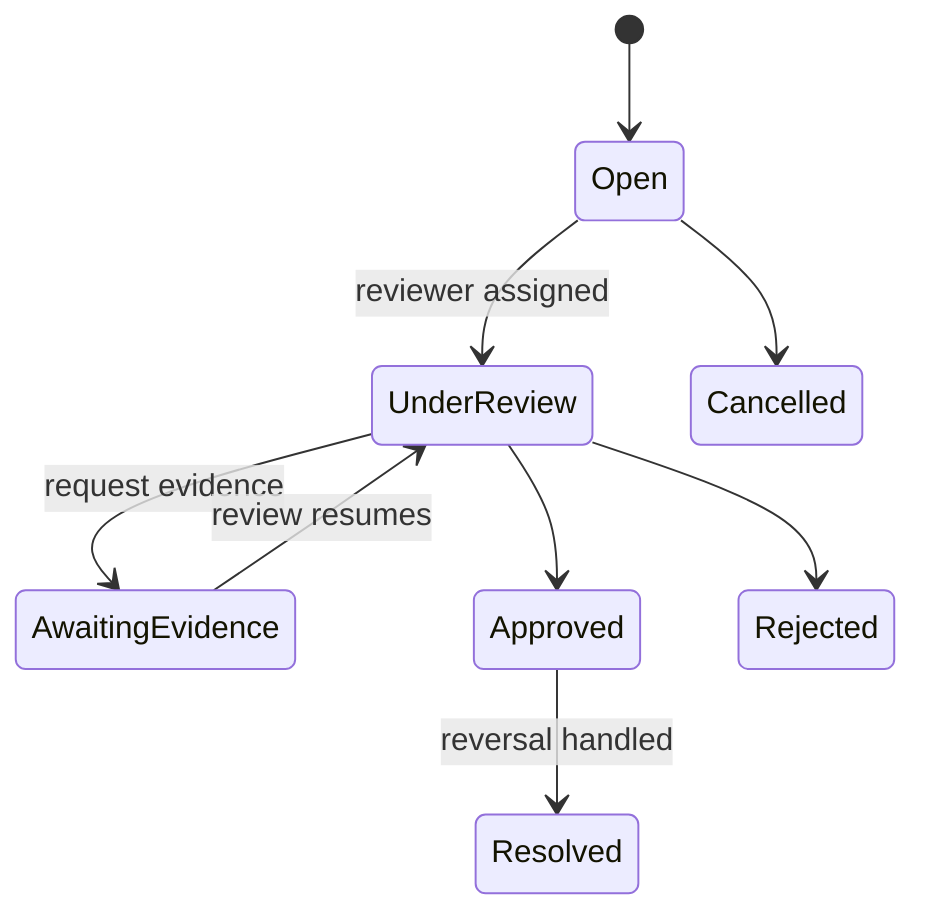
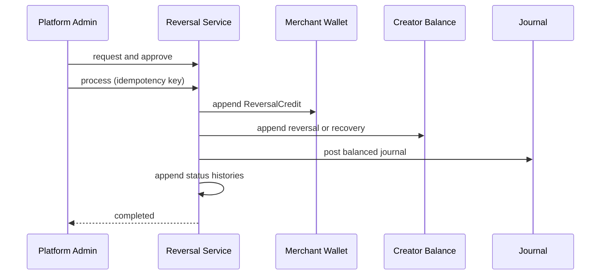

# Disputes, fraud, and reversals

Milestone 16 introduces metadata-only evidence, configurable/versioned fraud rules, scoped disputes, and append-only financial reversals. Confirmed purchases, commission snapshots, earnings, payouts, wallet history, and posted journals are never edited or deleted.

## Fraud controls

Rules are stored as `FraudRule` and effective-dated `FraudRuleVersion` rows. Configuration is JSONB, keeping thresholds outside controllers. Evaluation accepts a supplied UTC occurrence time, stage, merchant scope, masked phone hash, and transaction values. Supported evaluation outcomes are Allow, AllowWithAlert, RequireManualReview, and Block. Initial executable rules cover large purchase, large creator commission, and round-number activity; the model supports velocity, repeated-phone, cashier/device/creator cross-merchant activity, override, OTP, QR tampering, access, and insufficient-wallet rules as later rule definitions/query strategies. Alerts are de-duplicated by rule version and transaction.

No rule automatically reverses money or suspends a user. Every operational action appends review history and a non-sensitive audit event. Phone hashes may be retained for matching; raw phone numbers, OTPs, secrets, and credentials are excluded.

## Disputes and evidence

Creators can open/view disputes only for their creator transactions. Merchant admins are restricted to their merchant. Platform admins assign reviewers, request evidence, decide, and cancel. Evidence stores type, safe filename/content type, and JSON metadata—not file bytes. Rejection makes no financial change. Approval authorizes, but does not itself execute, a reversal.

## Reversal accounting

Processing uses a serializable database transaction. The merchant receives the reversed total commission. Creator/platform amounts are allocated from the immutable snapshot: creator amount is rounded once to 2 decimals using AwayFromZero, and platform receives the exact remainder, preserving total equality. The journal debits PlatformCommissionRevenue and CreatorPayable, then credits MerchantWalletLiability. For paid earnings, payout/cash history remains untouched and CreatorRecoveryReceivable replaces CreatorPayable; a `CreatorRecoveryBalance` is created for manual recovery. Recovery never silently drives available balance negative.

Full reversal marks the purchase and unpaid earning Reversed. Partial reversal marks the purchase PartiallyReversed and leaves the earning lifecycle intact while appending the proportional balance entry. Unique operation keys, wallet-entry keys, a completed-full-reversal constraint, concurrency tokens, restrictive relationships, and atomic posting prevent duplicate or partial effects.

## API and authorization

The `/api/v1/creator/disputes` and `/api/v1/merchant/disputes` collections support POST/list/detail. `/api/v1/admin/disputes` supports list/detail/assign/request-evidence/approve/reject/cancel. `/api/v1/admin/fraud-alerts` supports list/detail/status/assign/resolve. `/api/v1/admin/reversals` supports create/list/detail/approve/process/cancel. Only PlatformAdmin can access fraud internals or reversal commands. Supervisor and Cashier receive no reversal authority.

## Known limitations and recovery policy

Evidence file storage, automated debt collection, advanced aggregate/velocity query implementations, and automated suspension are intentionally deferred. Recovery balances require platform review and later offset/waiver tooling; paid payout rows and cash journals remain immutable. A failed atomic reversal is safe to retry with the same idempotency key.

Recommended Milestone 17: operationalize advanced aggregate fraud rules, evidence object storage with malware scanning, recovery settlement/waiver workflows, and richer case-management notifications without adding a real payment provider prematurely.
