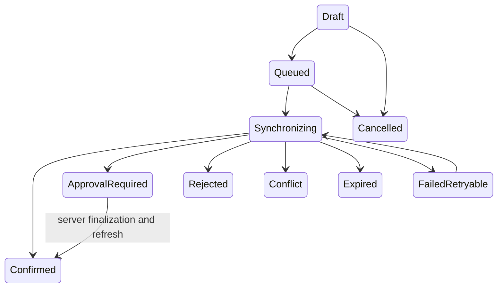

# Offline PWA and reliable synchronization

Milestone 17 makes the cashier workspace installable and permits disconnected capture. A queued operation is only a request: no wallet deduction, commission, earning, approval, or success is authoritative until the server confirms it.

## Architecture

```mermaid
sequenceDiagram
 actor C as Cashier
 participant P as React PWA
 participant I as IndexedDB
 participant A as Offline sync API
 participant W as Existing purchase workflow
 participant D as PostgreSQL
 C->>P: Enter location, QR, phone, amount
 P->>I: AES-GCM protect and queue
 P-->>C: Queued — not confirmed
 P->>A: Authenticated ordered batch
 loop Independent item boundary
  A->>W: Repeat-use gate and purchase confirmation
  W->>D: Revalidate and transact
  D-->>A: Confirmed, duplicate, approval, or rejection
 end
 A-->>P: Ordered safe results + correlation IDs
 P->>I: Update status; erase confirmed sensitive payload
```

The API reuses `IRepeatUseApprovalService` and `IWalletService`; cashier/account/role, merchant/location scope, QR, creator and merchant status, partnership and dates, restrictions, phone reuse/approval, commission, wallet, idempotency, and existing fraud controls are therefore rerun. Client timestamps and cached state are informational only.

## Browser storage and PWA policy

IndexedDB `creatorpay-offline-v1` has versioned `purchase-operations` and `crypto-keys` stores. Local operation is the primary key, idempotency key is unique, and status/creation time is indexed. QR and phone are AES-GCM protected with a non-extractable Web Crypto key; phone is masked in UI. Confirmed items discard protected QR/phone and age out after seven days. Encryption is defense in depth and cannot defeat XSS, browser-profile compromise, or an unlocked lost device.

The versioned service worker caches only same-origin shell/static GETs, using network first. API, authenticated, and non-GET requests bypass Cache Storage. Activation removes old caches but never IndexedDB, so updates cannot discard the queue. An offline fallback is available. Background Sync is optional; foreground manual sync and online-event fallback provide correctness.

Offline capture requires a previously authenticated Cashier JWT that has not expired. The client never extends it offline and does not put refresh tokens in the queue. A 401 preserves operations and requires login. Cached location labels are convenience only. Never cache authoritative wallet, full creator/customer data, OTP, authentication secrets, or payment credentials.

## API, states, retry, and approval

`POST /api/v1/cashier/offline-sync` is Cashier-only and financially rate limited. Batches are schema/version/size bounded (defaults: schema 1, 25 items, 24-hour maximum age, eight retries). Ordered results are Confirmed, ApprovalRequired, DuplicateConfirmed, Rejected, Conflict, Expired, or RetryLater. Each includes safe retry metadata, references, and correlation ID. Invalid items do not roll back siblings.

Durable batches store counts and only a SHA-256 hash of an optional installation identifier. Items store identifiers, request hash, safe result, references, and correlation. Unique cashier/client-operation plus existing merchant idempotency prevent duplicates and detect changed payload. Approval retries reuse one request and never issue an OTP automatically.



Network/5xx/429/RetryLater outcomes retry conservatively; permanent validation failures do not. `Retry-After` is surfaced, 401 waits for authentication, and retries cap at eight. Server receipt time drives financial processing; nothing is backdated.

## Security, operations, limitations

Production requires HTTPS. Payload/batch bounds, authorization, scope, rate limits, sanitized errors, and server validation apply. Logs and audit details exclude raw phone and QR. Support uses correlation IDs. A policy-driven logout wipe must warn about unsynced loss; Milestone 17 supplies item cancellation/removal but leaves global wipe policy to an explicit product/privacy decision.

Known limitations: the service worker does not sync while every app window is closed because credentials are intentionally unavailable to it; cached location selection accepts an ID if no cached label exists; update-ready plumbing has no dedicated banner; approval refresh is foreground-driven through existing approval/purchase APIs.

Recommended Milestone 18: implement the planned Platform Admin UI with privacy-safe batch diagnostics and correlation lookup, without expanding offline financial authority.
