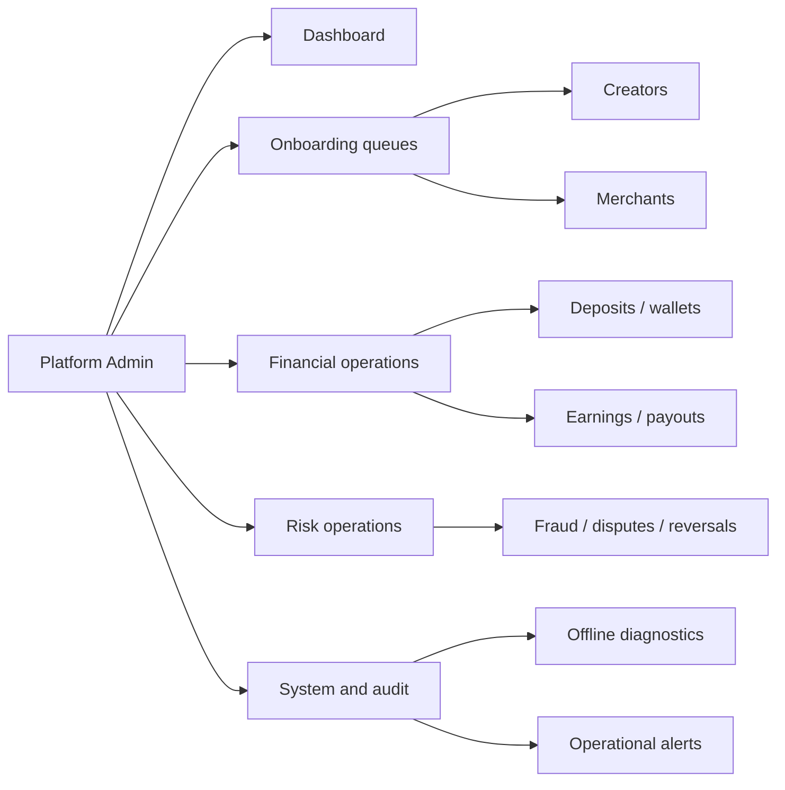
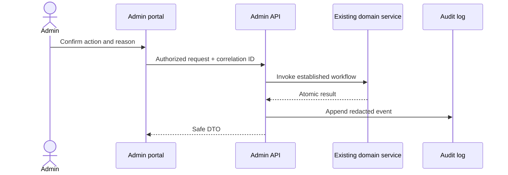

# Platform Admin Portal

Milestone 18 consolidates operational support at `/admin`. Every API under `/api/v1/admin` requires the `PlatformAdminOnly` policy; navigation visibility is not an authorization control. Unauthenticated requests return 401 and authenticated non-admin requests return 403.

## Navigation and permissions

Desktop, tablet, and urgent mobile workflows share an accessible sidebar, skip link, responsive data tables, pagination, loading, empty, error, and permission-denied states. UI strings use an English foundation; components avoid assumptions that block a future Amharic catalogue.

## Dashboard and reporting

`GET /api/v1/admin/dashboard/summary` uses database aggregates and accepts UTC `from`, `to`, and optional `merchantId`. `trends` groups purchases by date. Results never materialize complete tables. Admin lists use bounded server-side pages (default 25, maximum 100), projections, `AsNoTracking`, filters, and cancellation tokens. Expensive dashboard/search requests are rate limited.

## Support and privacy

Support search accepts public identifiers and correlation IDs, returns categorized deep links, and is limited to 25 results. Creator, merchant, and account responses mask email and phone values. Purchase idempotency keys are partially masked. Password hashes, refresh/reset tokens, OTPs, QR tokens, provider secrets, connection strings, and full payout destinations are absent from DTOs.

Account unlock and session revocation require an admin reason and create immutable operational audit events. There is no password reveal, impersonation, ownership transfer, direct wallet editing, or confirmed-purchase editing.

## Operational flow

Approval, deposit, commission, payout, notification, fraud, dispute, and reversal mutations remain in their existing audited services. The admin portal composes those APIs; it does not introduce alternative financial authority.

## Operational alerts

`OperationalAlert` and immutable history store safe descriptions, severity, state, correlation ID, and a cooldown key. A filtered unique index prevents more than one unresolved alert per cooldown key. Acknowledgement and resolution record actor, reason, timestamp, history, and audit event. Suggested producers include database/worker availability, backlog growth, failed payouts, reconciliation, journal imbalance, migration mismatch, authentication failures, fraud volume, and offline rejection spikes.

## Known limitations

- Custom date-range controls currently use the reporting API contract but the UI exposes the three preset ranges.
- No unrestricted export, bulk approval, impersonation, ownership transfer, direct balance adjustment, or offline confirmation override exists.
- System readiness is deliberately safe and configuration-level; secrets, raw Docker details, and connection strings are not returned.
- Alert producers are intended for the existing worker; this milestone provides persistence, deduplication, and admin lifecycle endpoints without creating a second scheduler.

## Recommended Milestone 19

Add policy-governed saved views and export jobs, richer localized strings, alert producer thresholds managed through reviewed configuration, and end-to-end browser accessibility tests. Do not expand financial authority as part of that work.
