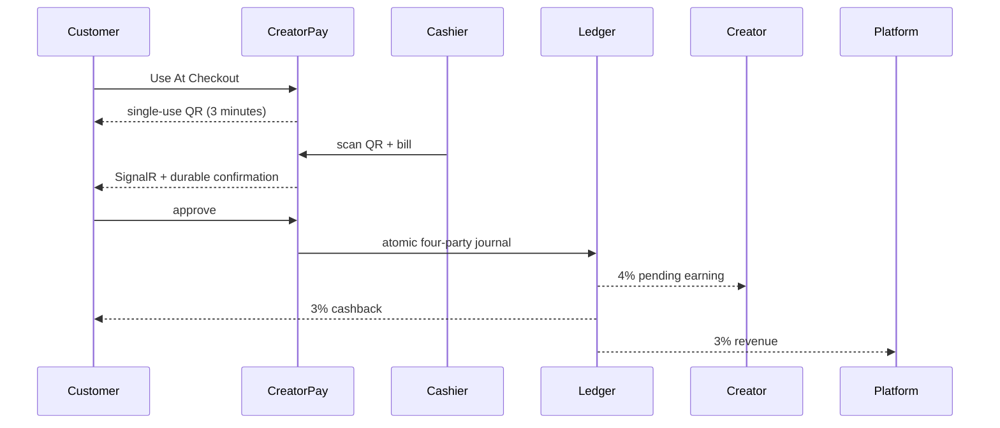
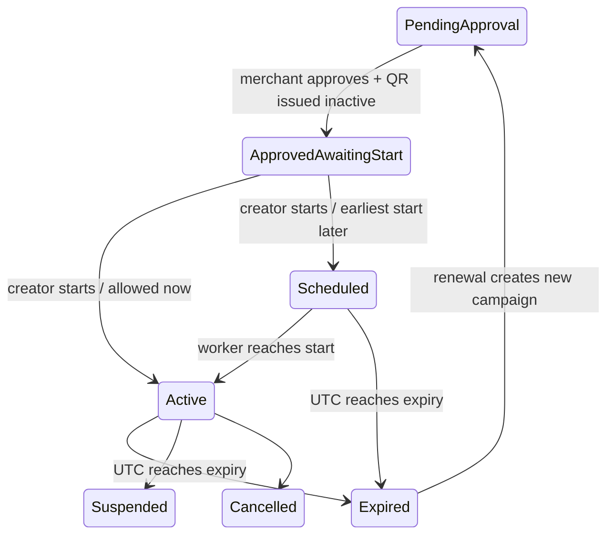
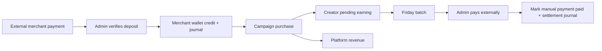

# Campaign lifecycle and manual finance (Milestone 20.1)

## Final four-party checkout

The final architecture has Creator, registered Customer, Merchant, and Platform participants. An effective versioned campaign rule is exactly 10% of purchase value, split 40%/30%/30% of commission (4% creator, 3% customer cashback, 3% platform). A customer selects a campaign and receives a random, hash-persisted checkout QR valid for three minutes and one presentation. Cashier presentation records the bill and sends both a SignalR event and durable notification. No financial rows are created until the owning customer approves.

At 1,000 ETB, customer payout creation reserves only the full available cashback balance. Platform Admin then records manual processing, payment, or failure. New merchants may use platform trial credit until the third confirmed sale or 1,000 ETB aggregate commission, whichever occurs first. Trial journals debit Platform Trial Credit Expense instead of merchant escrow.

The three QR types are permanent merchant discovery QR, expiring campaign QR, and three-minute single-use checkout QR. Discovery profiles hold the featured campaign, zone, safe social links, and saved promotions without financial authority.

CreatorPay remains the internal system of record. Money is received and paid outside the product; there are no bank, Telebirr, Telegram, SMS-reading, provider webhook, automatic matching, or automatic transfer integrations.

## Identity and campaign QR

The permanent creator ID and profile QR identify a creator for search and partnership approval. They cannot confirm a commission purchase. Every merchant partnership promotion uses a new `CreatorMerchantCampaign` and opaque `CampaignQrCode`; only a SHA-256 token hash is stored. The fallback campaign code aids manual entry but is not a security control. Expired and revoked QR records are immutable and never reactivated.

The server sets `PublishedAtUtc`, `StartsAtUtc`, and `ExpiresAtUtc`; a creator cannot submit, backdate, or future-date them. Campaign QRs carry discovery and attribution only. A customer selects an eligible creator campaign and creates a three-minute checkout session; the cashier scans only that temporary checkout QR and enters the bill. The authenticated customer must approve before the server revalidates all participants and atomically posts the four-party journal. Each purchase snapshots campaign IDs, rule version, and campaign dates.

## Manual financial operations

Merchant deposit requests do not affect balances. Platform Admin approval creates the immutable deposit, wallet credit with before/after values, balanced journal, and audit trail. Commission confirmation atomically debits merchant liability, credits creator payable, recognizes platform revenue, and records pending creator earnings. Existing three-day maturation, weekly payout preparation, manual processing/paid/failed transitions, reversals, and reconciliation remain the source of truth. A batch never transfers money and never marks a payout paid.

Defaults are ETB 1,000 minimum activation, ETB 1,500 low-balance warning, 30-day campaigns, and Africa/Addis_Ababa Friday payout operations. These are configuration, not controller constants. Funding restriction blocks starts and purchases without deleting campaign history; verified funding can restore eligibility. Per-transaction overspend is rejected atomically.

## Authorization, operations, and limitations

Creators see/start/renew only their campaigns. Merchant Admins approve and operate only their merchant campaigns. Cashiers only validate at assigned locations. Platform Admins retain exclusive deposit verification, payout confirmation, reconciliation, and global review. Sensitive transitions create safe audit records without raw QR tokens, full phones, or bank secrets. The distributed advisory-lock worker activates and expires campaigns idempotently.

Known MVP limitations: the approval screen accepts a rule-version ID instead of a rich picker; QR payload is shown once at approval and should be rendered/downloaded by a future media service; notification templates for every new event and calendar-aware Friday orchestration remain operational follow-up. Recommended Milestone 21: production-grade campaign media delivery, richer configurable scheduling, and notification/template administration—without changing the manual-money boundary unless separately approved.
